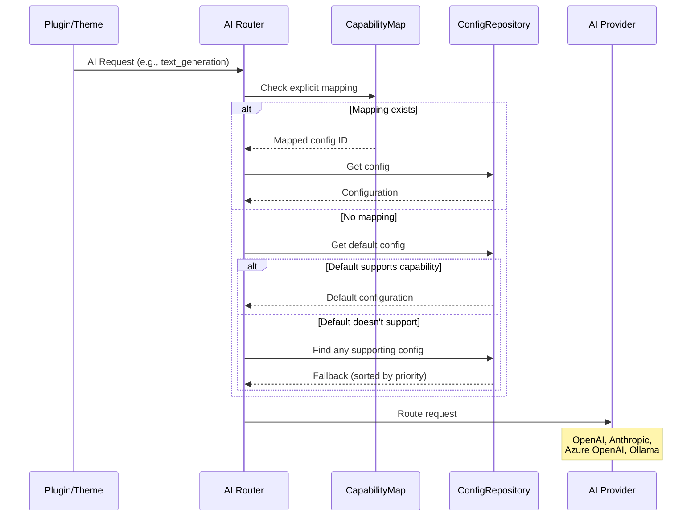

# AI Router Documentation

AI Router provides **capability-based routing** for WordPress 7.0 AI requests — automatically directing each request to the most appropriate provider configuration.

## Why AI Router?

WordPress 7.0 introduced the AI Client SDK, but different providers excel at different tasks:

- **OpenAI GPT-4** — text generation and chat
- **DALL-E / Stable Diffusion** — image generation
- **Anthropic Claude** — reasoning and analysis
- **Local Ollama models** — privacy and cost benefits

AI Router lets you configure multiple providers and route each capability to the best one.

## Documentation

| Document | Description |
|----------|-------------|
| [Routing](routing.md) | How routing decisions are made (priority, fallbacks) |
| [Data Model](data-model.md) | Configuration, RequestContext, and Vocabulary DTOs |
| [Provider Discovery](provider-discovery.md) | How AI providers are discovered and configured |
| [WordPress Integration](wordpress-integration.md) | Hooks, REST API, credential sync |
| [Extensibility](extensibility.md) | Filters, actions, security considerations |

## Architecture Overview



## Layers

| Layer | Components |
|-------|------------|
| **Admin UI** | `ConnectorsIntegration.php`, `connectors.js` |
| **REST API** | `ConfigurationsController.php` |
| **Domain** | `ConfigurationService.php`, `Vocabulary.php` |
| **Core Logic** | `Router.php`, `CapabilityMap.php`, `ConnectorSync.php`, `ProviderDiscovery.php` |
| **Data** | `ConfigurationRepository.php`, `Configuration.php`, `RequestContext.php` |
| **Storage** | `wp_options` |

## Directory Structure

```text
ai-router/
├── src/
│   ├── DTO/
│   │   ├── Configuration.php         # Immutable config data object
│   │   └── RequestContext.php        # Per-request routing state
│   ├── Repository/
│   │   └── ConfigurationRepository.php
│   ├── Service/
│   │   └── ConfigurationService.php  # Domain logic
│   ├── Admin/
│   │   └── ConnectorsIntegration.php
│   ├── Rest/
│   │   └── ConfigurationsController.php
│   ├── Vocabulary.php
│   ├── CapabilityMap.php
│   ├── ConnectorSync.php
│   ├── Router.php
│   └── ProviderDiscovery.php
├── src/js/
│   └── connectors.js
└── tests/
    ├── php/   # PHPUnit (126 tests)
    └── js/    # Vitest (6 tests)
```

## Supported Capabilities

| Capability | Description |
|------------|-------------|
| `text_generation` | Generate text responses (GPT, Claude, etc.) |
| `chat_history` | Maintain conversation context |
| `image_generation` | Generate images (DALL-E, Stable Diffusion) |
| `embedding_generation` | Create vector embeddings |
| `text_to_speech_conversion` | Convert text to audio |
| `speech_generation` | Generate speech/audio |
| `music_generation` | Generate music |
| `video_generation` | Generate video content |
