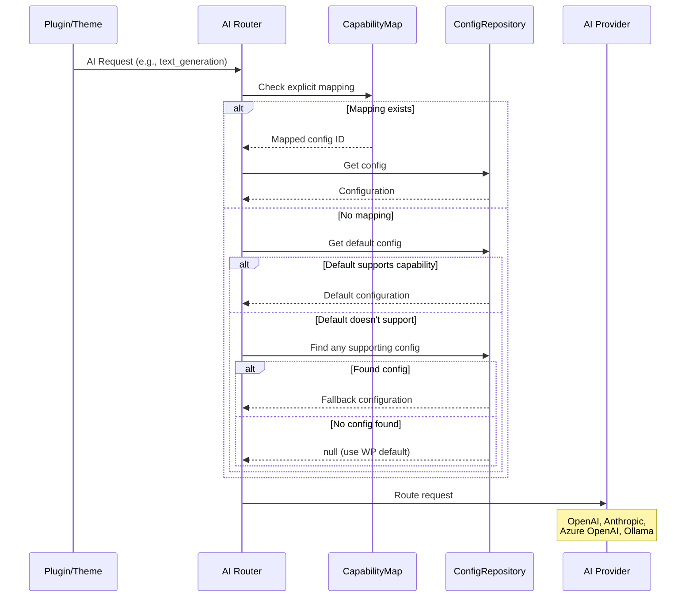

# AI Router Architecture

## Rationale

WordPress 7.0 introduced the AI Client SDK, enabling plugins and themes to leverage AI capabilities like text generation, image generation, embeddings, and more. However, the SDK presents a challenge: **different AI providers excel at different tasks**.

- **OpenAI GPT-4** excels at text generation and chat
- **DALL-E / Stable Diffusion** specializes in image generation
- **OpenAI Whisper** handles speech-to-text
- **Anthropic Claude** offers strong reasoning capabilities
- **Local Ollama models** provide privacy and cost benefits

Without AI Router, developers must hardcode provider choices or build custom switching logic. AI Router solves this by providing **capability-based routing** — automatically directing each AI request to the most appropriate provider configuration.

## Core Concept



## Architecture Overview

### Layers

| Layer | Components |
|-------|------------|
| **Admin UI** | `SettingsPage.php`, `ConnectorsIntegration.php`, `admin.js`, `connectors.js` |
| **REST API** | `ConfigurationsController.php` |
| **Core Logic** | `Router.php`, `CapabilityMap.php`, `ProviderDiscovery.php` |
| **Data** | `ConfigurationRepository.php`, `Configuration.php` |
| **Storage** | `wp_options` |

### Directory Structure

```
ai-router/
├── src/
│   ├── DTO/
│   │   └── Configuration.php      # Immutable config data object
│   ├── Repository/
│   │   ├── ConfigurationRepositoryInterface.php
│   │   └── ConfigurationRepository.php  # CRUD for configs
│   ├── Admin/
│   │   ├── SettingsPage.php       # Settings → AI Router page
│   │   └── ConnectorsIntegration.php  # Settings → Connectors page
│   ├── Rest/
│   │   └── ConfigurationsController.php  # REST API endpoints
│   ├── CapabilityMap.php          # Capability → Config mapping
│   ├── Router.php                 # Core routing logic
│   └── ProviderDiscovery.php      # Discovers installed providers
├── src/js/
│   ├── admin.js                   # Settings page React UI
│   └── connectors.js              # Connectors page integration
└── tests/
    ├── php/                       # PHPUnit + Brain Monkey tests
    └── js/                        # Vitest + Testing Library tests
```

### Data Flow

1. Admin UI sends `POST /ai-router/v1/configurations`
2. REST controller validates and sanitizes input
3. Repository saves via `update_option()`
4. JSON response returned to UI

## Routing Logic

The `Router::get_configuration_for_capability()` method implements the selection algorithm:


### Priority Order

1. **Explicit Mapping** — If a capability is explicitly mapped to a configuration via the UI's "Capability Routing" section, use that configuration.

2. **Default Configuration** — If no explicit mapping exists, check if the default configuration supports the requested capability.

3. **Best Effort** — If no default is set or it doesn't support the capability, use the first available configuration that supports it.

### Example Scenario

**Configurations:**
- GPT-4 Config (OpenAI) — default, supports `text_generation`, `chat_history`
- Claude Config (Anthropic) — supports `text_generation`
- DALL-E Config (OpenAI) — supports `image_generation`

**Routing Results:**
- `text_generation` → GPT-4 Config (default, supports it)
- `image_generation` → DALL-E Config (only one supports it)
- `chat_history` → GPT-4 Config (only one supports it)

If Claude Config were set as default instead:
- `text_generation` → Claude Config (default, supports it)
- `chat_history` → GPT-4 Config (Claude doesn't support it, fallback)

## Configuration Data Model

```php
final readonly class Configuration implements JsonSerializable {
    public function __construct(
        public string $id,           // UUID
        public string $name,         // Display name
        public string $provider_type,// openai, anthropic, azure_openai, etc.
        public array $settings,      // api_key, endpoint, model, etc.
        public array $capabilities,  // text_generation, image_generation, etc.
        public bool $is_default,     // Default fallback flag
    ) {}
}
```

## Capability Map

The `CapabilityMap` class manages explicit routing rules stored in `wp_options`:

```php
// Option: ai_router_capability_map
[
    'text_generation'  => 'config-uuid-1',
    'image_generation' => 'config-uuid-2',
    // ... other mappings
]
```

When a capability has an explicit mapping, that configuration is used regardless of the default setting.

## WordPress Integration

### Hooks

AI Router integrates via WordPress hooks:

```php
// Before AI generation — inject routing
add_action('wp_ai_client_before_generate_result', [$this, 'before_generate'], 5, 2);

// Set up provider authentication
add_action('init', [$this, 'setup_provider_authentication'], 25);
```

### REST API Endpoints

| Endpoint | Method | Description |
|----------|--------|-------------|
| `/ai-router/v1/configurations` | GET | List all configurations |
| `/ai-router/v1/configurations` | POST | Create configuration |
| `/ai-router/v1/configurations/{id}` | GET | Get single configuration |
| `/ai-router/v1/configurations/{id}` | PUT | Update configuration |
| `/ai-router/v1/configurations/{id}` | DELETE | Delete configuration |
| `/ai-router/v1/capability-map` | GET | Get capability mappings |
| `/ai-router/v1/capability-map` | POST | Update capability mappings |
| `/ai-router/v1/default` | GET | Get default configuration ID |

## Supported Capabilities

AI Router supports all WordPress 7.0 AI Client SDK capabilities:

| Capability | Description |
|------------|-------------|
| `text_generation` | Generate text responses (GPT, Claude, etc.) |
| `chat_history` | Maintain conversation context |
| `image_generation` | Generate images (DALL-E, Stable Diffusion) |
| `embedding_generation` | Create vector embeddings |
| `text_to_speech_conversion` | Convert text to audio |
| `speech_generation` | Generate speech/audio |
| `music_generation` | Generate music |
| `video_generation` | Generate video content |

## Extensibility

### Filters

```php
// Override configuration selection
add_filter('ai_router_get_configuration', function($config, $capability) {
    // Custom logic
    return $config;
}, 10, 2);

// Modify fallback configuration
add_filter('ai_router_fallback_config', function($config, $capability) {
    // Custom fallback logic
    return $config;
}, 10, 2);
```

### Actions

```php
// After routing decision is made
add_action('ai_router_routed', function($config, $capability, $prompt_builder) {
    // Logging, analytics, etc.
}, 10, 3);
```

## Security

- All REST endpoints require `manage_options` capability
- API keys are stored encrypted in wp_options (when using core's encryption)
- Settings are sanitized via registered sanitize callbacks
- Nonces protect admin UI operations

## Future Considerations

- **Priority/Weight System** — Allow ordering when multiple configs support a capability
- **Load Balancing** — Distribute requests across multiple providers
- **Cost Tracking** — Monitor API usage and costs per provider
- **Health Checks** — Automatic failover when a provider is unavailable
- **Rate Limiting** — Per-provider rate limit management
